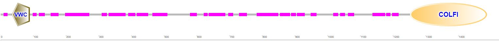

## Protein Domains Summary

How To identify the protein domains? [SEE HERE](https://www.biostars.org/p/58634/#406303)

Figure 2. Protein sequence alignment for FGF-4, FGF-5, and FGF-6 with heparin and FGFR-binding domains. Protein domains summarized from a previous FGF-6 functional study. 58 Alignment and heparin and FGFR-binding sites/regions (HBS and FGFR-BR, respectively) are shown for FGF-4, FGF-5, and FGF-6 proteins.

* [Graphical summary to Conserved domains](https://www.ncbi.nlm.nih.gov/Structure/cdd/wrpsb.cgi)

Figure 2. Protein sequence alignment for COL2A1 with heparin and FGFR-binding domains. Protein domains summarized from a previous FGF-6 functional study. 58 Alignment and heparin and FGFR-binding sites/regions (HBS and FGFR-BR, respectively) are shown for FGF-4, FGF-5, and FGF-6 proteins. 

SMART (a Simple Modular Architecture Research Tool) allows the identification and annotation of genetically mobile domains and the analysis of domain architectures. More than 500 domain families found in signalling, extracellular and chromatin-associated proteins are detectable. These domains are extensively annotated with respect to phyletic distributions, functional class, tertiary structures and functionally important residues. Each domain found in a non-redundant protein database as well as search parameters and taxonomic information are stored in a relational database system. User interfaces to this database allow searches for proteins containing specific combinations of domains in defined taxa. For all the details, please refer to the publications on SMART.

SMART: [Simple Modular Architecture Research Tool](http://smart.embl-heidelberg.de/smart/set_mode.cgi?NORMAL=1)

