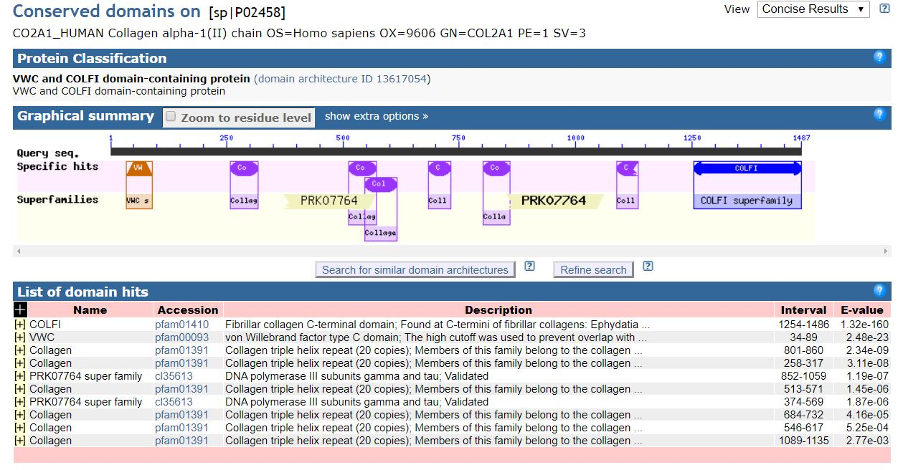

## Protein Domains Summary

Figure 2. Protein sequence alignment for FGF-4, FGF-5, and FGF-6 with heparin and FGFR-binding domains. Protein domains summarized from a previous FGF-6 functional study. 58 Alignment and heparin and FGFR-binding sites/regions (HBS and FGFR-BR, respectively) are shown for FGF-4, FGF-5, and FGF-6 proteins.

* [Graphical summary to Conserved domains](https://www.ncbi.nlm.nih.gov/Structure/cdd/wrpsb.cgi)

Figure 2. Protein sequence alignment for COL2A1 with heparin and FGFR-binding domains. Protein domains summarized from a previous FGF-6 functional study. 58 Alignment and heparin and FGFR-binding sites/regions (HBS and FGFR-BR, respectively) are shown for FGF-4, FGF-5, and FGF-6 proteins. 

SMART: [Simple Modular Architecture Research Tool](http://smart.embl-heidelberg.de/smart/set_mode.cgi?NORMAL=1)
